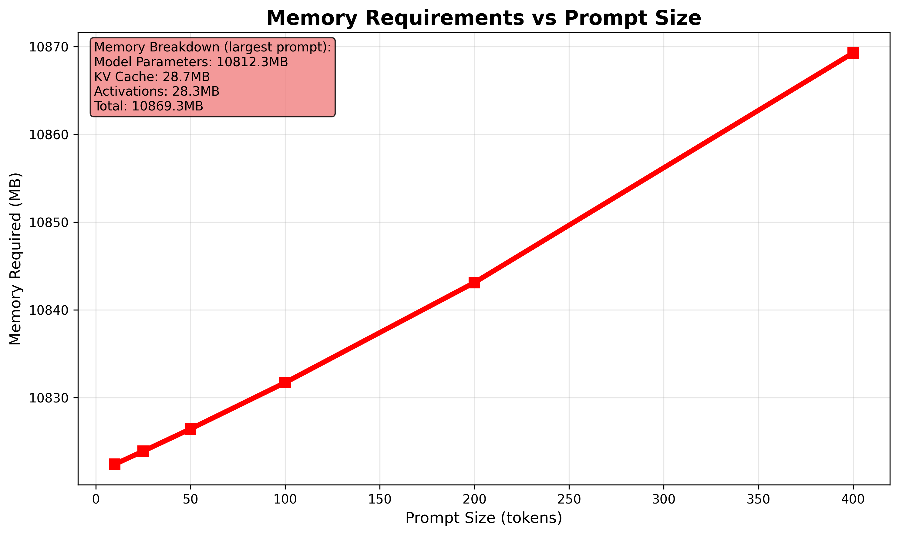
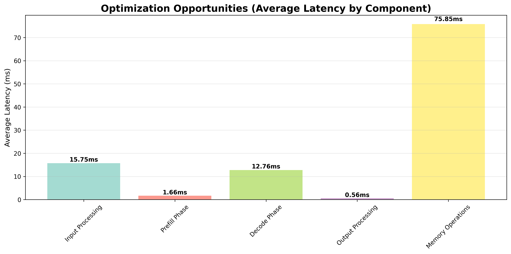
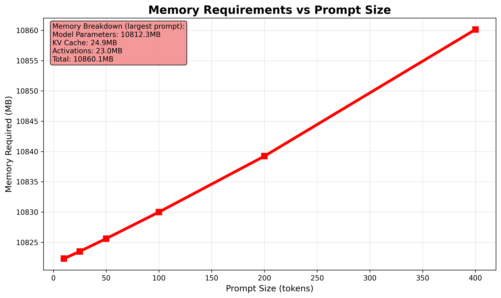
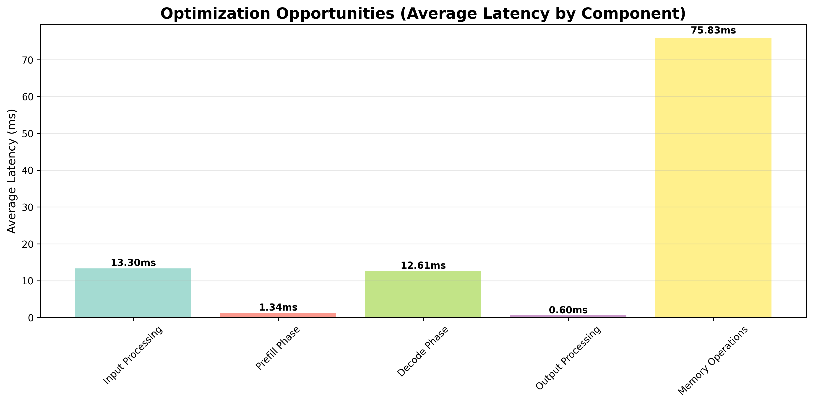
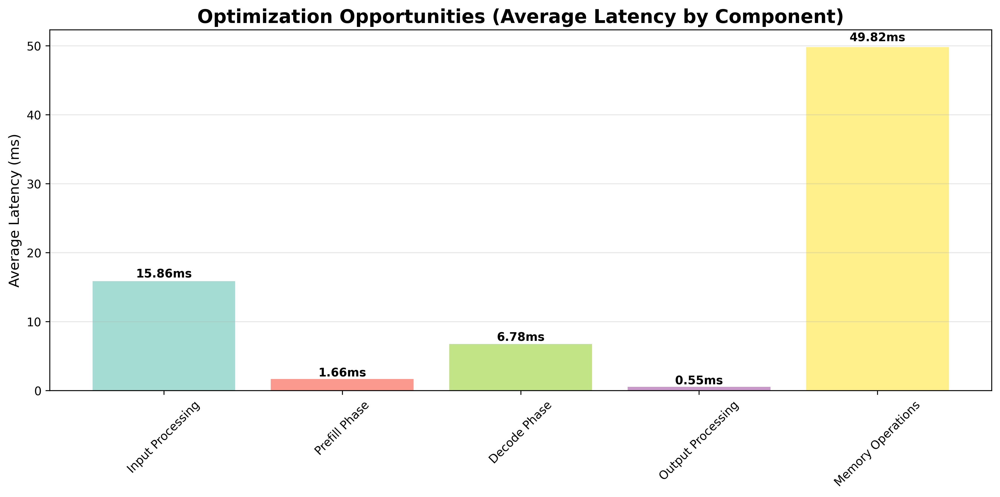

# A Deep Dive into LLM Inference Latencies

## Why?

Large language model deployment has become a critical capability for modern applications, yet inference optimization remains poorly understood across the industry. While significant resources are allocated to model training, the engineering challenges of production inference often determine deployment success or failure.

Latency directly correlates with user experience metrics and operational expenditure. However, the underlying factors contributing to inference latency form a complex, interdependent system. Engineering teams consistently face fundamental questions: Where do performance bottlenecks actually occur? Which optimization strategies deliver measurable improvements? How do hardware configurations impact real-world performance characteristics?

This analysis presents empirical findings from comprehensive benchmarking designed to address these questions systematically.

## Experimental Configuration

All benchmarks were conducted on the NVIDIA H100 80GB PCIe variant. Note: The SXM5 variant offers 3.35 TB/s bandwidth, 16,896 CUDA cores, and a peak TDP 700W (double the PCIe variant's peak TDP).

Test hardware specifications:

- **80GB HBM2e memory** with 2.0 TB/s memory bandwidth
- **14,592 CUDA cores** featuring 456 fourth-generation Tensor cores
- **5120-bit memory bus interface** supporting high-bandwidth operations
- **350W TDP** similar TDP to top consumer-grade cards

### Models

Three models were chosen based on their popularity in the last year. We explore the different considerations between how different architectures affects realized latencies at each stage.

#### Good to Know: Memory Components

Before diving into specific models, it's helpful to understand the three main memory components:

- **Model Parameters**: The weights and biases stored in the model (e.g., 7B parameters × 2 bytes for BF16 = ~14GB)
- **Activations**: Intermediate computation results during forward pass (varies with batch size and sequence length)
- **KV Cache**: Stores key-value pairs from attention layers to avoid recomputation during autoregressive generation

**KV Cache Formula:**

The KV cache size calculation depends on the attention mechanism used:

**For Multi-Head Attention (MHA):**
```
KV Cache Size = batch_size × sequence_length × num_layers × num_heads × head_dim × 2 × dtype_size
```

**For Grouped Query Attention (GQA):**
```
KV Cache Size = batch_size × sequence_length × num_layers × num_kv_heads × head_dim × 2 × dtype_size
```

**Key Differences:**
- **MHA**: Uses `num_heads` - every query head has its own key and value heads
- **GQA**: Uses `num_kv_heads` - multiple query heads share the same key and value heads within groups
- **Memory Reduction**: GQA reduces KV cache size by the ratio `num_heads ÷ num_kv_heads`

The factor of 2 that can be seen in both formulas accounts for both key and value tensors. Additionally, dtype_size is measured in bytes, so BF16 would be 2 bytes, as an example.

These distinctions are crucial for understanding the memory characteristics of our three test models, which are all using GQA.

Awesome! now let's dive into what this means for our chosen models.

1. **Qwen 2.5 7B Instruct** - A dense 7.61B parameter model with 128K context length support. Uses Group Query Attention (GQA) with 28 query heads and 4 KV heads, plus rotary positional embeddings (RoPE) and YaRN for context extension across 28 layers. Uses ~10.8 GB for model parameters, with KV cache scaling linearly with prompt size. At our largest tested prompt of 400 tokens, the KV cache is 61.5 MB, so our total memory usage is ~10.9 GB. Note: Full 128K context would require additional ~7.0 GB for KV cache (using 28 layers, 4 KV heads, 128 head dimension, BF16).





2. **Deepseek R1 Distill Qwen 7B** - A dense 7.61B parameter model distilled from DeepSeek-R1 using 800K reasoning samples. Based on Qwen 2.5 architecture with GQA (28 query heads, 4 KV heads) and YaRN for context extension across 28 layers, but optimized for reasoning tasks. Uses ~10.8 GB for model parameters, with KV cache scaling linearly with prompt size. At our largest tested prompt of 400 tokens, the KV cache is 61.5 MB, so our total memory usage is ~10.9 GB. Note: Full 128K context would require additional ~7.0 GB for KV cache (using 28 layers, 4 KV heads, 128 head dimension, BF16).





3. **GPT OSS 20B** - A mixture-of-experts (MoE) model with 21B total parameters but only 3.6B active parameters per forward pass, trained using quantization-aware training (QAT) to MXFP4 format. Uses GQA with 64 query heads and 8 KV heads, plus YaRN for 128K context extension across 24 layers. Uses ~10.6 GB for model parameters due to MXFP4 quantization (4.25 bits per parameter), with KV cache scaling linearly with prompt size. At our largest tested prompt of 400 tokens, the KV cache is 49.2 MB, so our total memory usage is ~10.7 GB. Note: Full 128K context would require additional ~6.0 GB for KV cache (using 24 layers, 8 KV heads, 64 head dimension, BF16).




Overall, these architectures demonstrate some differences in how LLM optimization has evolved overtime, going from dense transformers, to sparse MoE architectures, as well as using different attention techniques; all for the benefit of higher throughput and lower memory footprint. 

Now let's dive into what latencies are measured during LLM inference.

### Inference Latency and Memory Analysis

We run a comprehensive benchmark catered around vLLM's inference engine that targets the key latencies in LLM inference. Let's break them down in the following section:

#### Model Loading

Model loading is an important component of cold-start latencies for LLM inference. Several key factors contribute to model loading times and present interesting optimization opportunities:

**Memory Bandwidth Bottlenecks**: While we don't consider model loading in our benchmarks, since it is only a one time cost, it is still important to understand the breakdown. The Qwen 2.5 7B and DeepSeek R1 Distill models each require ~10.8 GB of GPU memory for their BF16 weights, while the GPT OSS 20B uses only ~10.6 GB due to its MXFP4 quantization format. Loading times can be broken down into the following steps:

1. **Storage Read**: Reading model weights from Disk into system RAM. Modern PCI-e 4.0 NVMe drives achieve in the order of ~3.5-7 GB/s sustained sequential reads, so transferring our ~10.8 GB safetensors files take approximately 1.5-3 seconds in a best case scenario, driven by sequentiality of the data and drive performance.

2. **Deserialization and Preprocessing**: Converting safetensors format into memory tensors, performing any required format validation, and preparing data structures for GPU transfer. This CPU-bound operation adds modest overhead but is necessary for safe model loading.

3. **PCIe Transfers**: Moving processed tensors from system RAM to GPU VRAM over PCIe 4.0 x16 interface, is a critical step for our particular system. While PCIe 4.0 x16 provides ~64 GB/s full-duplex (bi-directional) theoretical bandwidth, practical sustained one-way transfer rates are typically 25-28 GB/s, due to protocol overhead and system factors.

4. **GPU Memory Allocation and Tensor Layout**: Final stage involves CUDA memory allocation, optimal tensor layout for compute kernels, and internal memory organization on the H100's HBM2e memory subsystem with an internal bandwidth, as seen earlier, of 2 TB/s.

#### Input Processing

Input processing represents the initial stage of LLM inference, converting raw text into model-ready tensors. While often overlooked in optimization discussions, this phase can contribute significant latency overhead, particularly for high-frequency, short-sequence requests. We have the following stages:

1. **Text preprocessing**: Unicode normalization, whitespace handling, and special character escaping using standard text processing libraries
2. **Tokenization**: vLLM integrates Hugging Face's fast tokenizers via `AutoTokenizer.from_pretrained()` that operate with O(n) time complexity through optimized finite state automata, with vocabulary lookups implemented as hash tables
3. **Attention mask generation**: Binary mask creation using vectorized operations to handle padding tokens and causal masking requirements
4. **Tensor preparation**: PyTorch tensor conversion with dtype casting and CUDA memory transfers via cudaMemcpy

Input processing latency scales primarily with input sequence length and tokenizer implementation efficiency. vLLM employs Hugging Face's fast tokenizers which achieve O(n) time complexity through optimized finite state automata, significantly outperforming slow tokenizers. For our test models, vLLM automatically selects the appropriate fast tokenizer implementation. The CPU-bound nature of tokenization can create bottlenecks under high load, which vLLM mitigates through microbatching techniques that process multiple tokenization requests concurrently.

#### KV-Cache Prefilling

The prefill phase represents the computationally intensive stage of LLM inference, where the model processes the entire input prompt to populate the key-value cache that enables efficient autoregressive generation. This phase involves parallel processing of all input tokens through the transformer stack, making it fundamentally different from the sequential decode phase. We have the following stages:

1. **Attention computation across all input tokens**: Flash Attention algorithm for memory-efficient attention with O(n) memory complexity instead of O(n^2), using block-sparse computation and online softmax as the basis.
2. **KV cache population**: Contiguous memory allocation for key-value tensors using PagedAttention for non-contiguous memory management, reducing fragmentation through virtual memory blocks
3. **Memory allocation**: CUDA unified memory allocation via cudaMalloc with memory pool optimization to reduce allocation overhead
4. **Tensor operations**: Optimized GEMM operations using cuBLAS libraries, with Tensor Core acceleration on H100 for mixed-precision (BF16) matrix multiplications

Despite being traditionally viewed as the primary bottleneck, modern inference engines have heavily optimized these operations through Flash Attention, PagedAttention, and efficient CUDA kernel fusion, resulting in surprisingly low latency contributions in practice.

#### Decode

#### Output Processing

