# A Deep Dive into LLM Inference Latencies

## Why?

Large language model deployment has become a growing necessity for modern applications, yet inference optimization remains sparsely understood across the industry. While significant resources are allocated to model training, the engineering challenges of production inference often determine deployment successes.

Latency directly correlates with user experience metrics and operational expenditure. However, the underlying factors contributing to inference latency form a complex, interdependent system. Engineering teams consistently face fundamental questions: Where do performance bottlenecks actually occur? Which optimization strategies deliver measurable improvements? How do hardware configurations impact real-world performance characteristics?

At Hathora, our experience with ultra-low latency gaming infrastructure and Elastic Metal platform positioned us to explore inference optimization challenges. The gaming industry's stringent latency requirements provided valuable insights into performance engineering that translate well to LLM serving.

The inference landscape is populated with numerous providers implementing various strategies to optimize computational latency through custom GPU kernels, specialized hardware, and advanced inference frameworks. While these efforts have successfully reduced on-GPU processing times, there remains a notable gap in addressing network latency and comprehensive autoscaling across the entire inference stack.

Our gaming infrastructure at Hathora already addresses many of these challenges through proven techniques: hosting servers in close proximity to end-users, routing traffic through a private backbone to minimize packet travel distance, and enabling rapid autoscaling that spins up resources in seconds to meet fluctuating demand. These capabilities translate directly to inference optimization challenges.

Building on this foundation, we identified opportunities to minimize end-to-end inference latency by:

- **Reducing network latency**: Leveraging our existing global edge infrastructure to deploy models closer to end-users, reducing round-trip times for inference requests
- **Optimizing inference request latency**: Beyond computational improvements, implementing techniques like speculative decoding, parameter disaggregation, and strategic partnerships with custom chip providers  
- **Enhancing operational flexibility**: Supporting custom model containers, multi-modal use cases, GPU-second billing, and rapid autoscaling with optimized cold starts

To systematically address these optimization questions, we conducted comprehensive latency profiling across representative model architectures. Rather than relying on theoretical analysis alone, we measured actual performance characteristics to understand where bottlenecks occur in practice. This empirical approach helps identify which optimization strategies provide measurable improvements under real deployment conditions. 

So, let's dive into the analysis of node-bound inference latencies.

## Experimental Configuration

All benchmarks were conducted on the NVIDIA H100 80GB PCIe variant. Note: The SXM5 variant offers 3.35 TB/s bandwidth via HBM3, 16,896 CUDA cores, and a peak TDP 700W (double the PCIe variant's TDP).

Test hardware specifications:

- **80GB HBM2e memory** with 2.0 TB/s memory bandwidth
- **14,592 CUDA cores** featuring 456 fourth-generation Tensor cores
- **5120-bit memory bus interface** supporting high-bandwidth operations
- **350W TDP** similar TDP to top consumer-grade cards

### Models

Three models were chosen based on their popularity in the last year. We explore the different considerations between how different architectures affects realized latencies at each stage.

#### Good to Know: Memory Components

Before diving into specific models, it's helpful to understand the three main memory components:

- **Model Parameters**: The weights and biases stored in the model (e.g., 7B parameters * 2 bytes for BF16 = ~14GB)
- **Activations**: Intermediate computation results during forward pass (varies with batch size and sequence length)
- **KV Cache**: Stores key-value pairs from attention layers to avoid recomputation during autoregressive generation

**KV Cache Formula:**

The KV cache size calculation depends on the attention mechanism used:

**For Multi-Head Attention (MHA):**
```
KV Cache Size = batch_size * sequence_length * num_layers * num_heads * head_dim * 2 * dtype_size
```

**For Grouped Query Attention (GQA):**
```
KV Cache Size = batch_size * sequence_length * num_layers * num_kv_heads * head_dim * 2 * dtype_size
```

**Key Differences:**
- **MHA**: Uses `num_heads` - every query head has its own key and value heads
- **GQA**: Uses `num_kv_heads` - multiple query heads share the same key and value heads within groups
- **Memory Reduction**: GQA reduces KV cache size by the ratio `num_heads ÷ num_kv_heads`

The factor of 2 that can be seen in both formulas accounts for both key and value tensors. Additionally, dtype_size is measured in bytes, so BF16 would be 2 bytes, as an example.

These distinctions are crucial for understanding the memory characteristics of our three test models, which are all using GQA.

Awesome! now let's dive into what this means for our chosen models.

1. **Qwen 2.5 7B Instruct** - A dense 7.61B parameter model with 128K context length support. Uses Group Query Attention (GQA) with 28 query heads and 4 KV heads, plus rotary positional embeddings (RoPE) and YaRN for context extension across 28 layers. Uses ~10.8 GB for model parameters, with KV cache scaling linearly with prompt size. At our largest tested prompt of 16384 tokens, the KV cache is 939 MB, so our total memory usage is ~11.8 GB. Note: Full 128K context would require additional ~7.4 GB for KV cache (using 28 layers, 4 KV heads, 128 head dimension, BF16).


2. **Deepseek R1 Distill Qwen 7B** - A dense 7.61B parameter model distilled from DeepSeek-R1 using 800K reasoning samples. Based on Qwen 2.5 architecture with GQA (28 query heads, 4 KV heads) and YaRN for context extension across 28 layers, but optimized for reasoning tasks. Uses ~10.8 GB for model parameters, with KV cache scaling linearly with prompt size. At our largest tested prompt of 16384 tokens, the KV cache is 939 MB, so our total memory usage is ~11.8 GB. Note: Full 128K context would require additional ~7.4 GB for KV cache (using 28 layers, 4 KV heads, 128 head dimension, BF16).


3. **GPT OSS 20B** - A mixture-of-experts (MoE) model with 21B total parameters but only 3.6B active parameters per forward pass, trained using quantization-aware training (QAT) to MXFP4 format. Uses GQA with 64 query heads and 8 KV heads, plus YaRN for 128K context extension across 24 layers. Uses ~10.6 GB for model parameters due to MXFP4 quantization (4.25 bits per parameter), with KV cache scaling linearly with prompt size. At our largest tested prompt of 16384 tokens, the KV cache is 805 MB, so our total memory usage is ~11.4 GB. Note: Full 128K context would require additional ~6.3 GB for KV cache (using 24 layers, 8 KV heads, 64 head dimension, BF16).


Overall, these architectures demonstrate some differences in how LLM optimization has evolved overtime, going from dense transformers, to sparse MoE architectures, as well as using different attention techniques; all for the benefit of higher throughput and lower memory footprint. 

Now let's dive into what latencies are measured during LLM inference.

### Inference Latency and Memory Analysis

We run a comprehensive benchmark catered around vLLM's inference engine that targets the key latencies in LLM inference. Let's break them down in the following section:

#### Model Loading

Model loading is an important component of cold-start latencies for LLM inference. Several key factors contribute to model loading times and present interesting optimization opportunities:

While we don't consider model loading in our benchmarks, since it is only a one time cost that ends up being dominated by request-based latencies, it is still important to understand the breakdown. The Qwen 2.5 7B and DeepSeek R1 Distill models each require ~10.8 GB of GPU memory for their BF16 weights, while the GPT OSS 20B uses only ~10.6 GB due to its MXFP4 quantization format. Loading times can be broken down into the following steps:

1. **Storage Read**: Reading model weights from Disk into system RAM. Modern PCI-e 4.0 NVMe drives achieve in the order of ~3.5-7 GB/s sustained sequential reads, so transferring our ~10.8 GB safetensors files take approximately 1.5-3 seconds in a best case scenario, driven by sequentiality of the data and drive performance.

2. **Deserialization and Preprocessing**: Converting safetensors format into memory tensors, performing any required format validation, and preparing data structures for GPU transfer. This CPU-bound operation adds modest overhead but is necessary for safe model loading.

3. **PCIe Transfers**: Moving processed tensors from system RAM to GPU VRAM over PCIe 4.0 x16 interface, is a critical step for our particular system. While PCIe 4.0 x16 provides ~64 GB/s full-duplex (bi-directional) theoretical bandwidth, practical sustained one-way transfer rates are typically 25-28 GB/s, due to protocol overhead and system factors.

4. **GPU Memory Allocation and Tensor Layout**: Final stage involves CUDA memory allocation, optimal tensor layout for compute kernels, and internal memory organization on the H100's HBM2e memory subsystem with an internal bandwidth, as seen earlier, of 2 TB/s.

#### Input Processing

Input processing represents the initial stage of LLM inference, converting raw text into model-ready tensors. While often overlooked in optimization discussions, this phase can contribute significant latency overhead, particularly for high-frequency, short-sequence requests. We have the following stages:

1. **Text preprocessing**: Unicode normalization, whitespace handling, and special character escaping using standard text processing libraries
2. **Tokenization**: vLLM integrates Hugging Face's fast tokenizers via `AutoTokenizer.from_pretrained()` that operate with O(n) time complexity through optimized finite state automata, with vocabulary lookups implemented as hash tables
3. **Attention mask generation**: Binary mask creation using vectorized operations to handle padding tokens and causal masking requirements
4. **Tensor preparation**: PyTorch tensor conversion with dtype casting and CUDA memory transfers via cudaMemcpy

Input processing latency scales primarily with input sequence length and tokenizer implementation efficiency. vLLM employs Hugging Face's fast tokenizers which achieve O(n) time complexity through optimized finite state automata, significantly outperforming slow tokenizers. For our test models, vLLM automatically selects the appropriate fast tokenizer implementation. The CPU-bound nature of tokenization can create bottlenecks under high load, which vLLM mitigates through microbatching techniques that process multiple tokenization requests concurrently.

#### KV-Cache Prefilling

The prefill phase represents the computationally intensive stage of LLM inference, where the model processes the entire input prompt to populate the key-value cache that enables efficient autoregressive generation. This phase involves parallel processing of all input tokens through the transformer stack, making it fundamentally different from the sequential decode phase. We have the following stages:

1. **Attention computation across all input tokens**: Flash Attention algorithm for memory-efficient attention with O(n) memory complexity instead of O(n^2), using block-sparse computation and online softmax as the basis.
2. **KV cache population**: Contiguous memory allocation for key-value tensors using PagedAttention for non-contiguous memory management, reducing fragmentation through virtual memory blocks
3. **Memory allocation**: CUDA unified memory allocation via cudaMalloc with memory pool optimization to reduce allocation overhead
4. **Tensor operations**: Optimized GEMM operations using cuBLAS libraries, with Tensor Core acceleration on H100 for mixed-precision (BF16) matrix multiplications

Despite being traditionally viewed as the primary bottleneck, vLLM has revolutionized this phase through PagedAttention, which treats KV cache management like virtual memory by dividing it into fixed-size blocks, reducing memory usage while eliminating fragmentation. Combining the latter with custom CUDA kernels optimized for H100's Tensor Cores, this reduces the penalty of this phase being compute-bound, meaning we are utilizing our compute resources as much as practically possible.

#### Decode

The decode phase represents the sequential token generation stage where the model produces output tokens one at a time. Unlike prefill's highly parallel operations, decode transforms efficient matrix-matrix operations into memory-bound matrix-vector operations which have lower occupancy on high-throughput tensor cores available to us on the H100. Unstructured sparsity does not favor the tensor core design, which are optimized specifically for dense cubic complexity operations that can be reduced to matrix multiplication.

Decode being a memory-bound operation means it's performance is constrained by memory bandwidth rather than compute throughput. Each token generation requires loading complete model parameters from the H100's 2.0 TB/s HBM2e memory, making memory bandwidth the primary performance bottleneck rather than compute performance.

vLLM's decode implementation involves four key stages:

1. **Token generation through autoregressive sampling**: Matrix-vector (GEMV) operations for single requests, or "tall and skinny" GEMM operations for batched requests
2. **KV cache expansion**: PagedAttention system appends new key-value pairs using non-contiguous virtual memory blocks to reduce fragmentation  
3. **Attention computation**: Custom multi-head query attention kernels process growing context with optimized memory access patterns for paged KV caches
4. **CUDA kernel optimization**: Specialized memory coalescing techniques and CUDA Graph optimization to minimize kernel launch overhead

#### Output Processing

Output processing represents the final stage of LLM inference, converting raw model outputs back into human-readable text. While often considered negligible, this CPU-bound phase can create significant bottlenecks in high-throughput scenarios, particularly when serving many concurrent requests or streaming responses.

vLLM addresses this by optimizing detokenization: breaking it into smaller chunks to avoid blocking the event loop and ensuring streaming stays responsive. In addition, the engine applies low-level memory optimizations (such as freezing the process heap after initialization) to reduce allocation overhead more broadly across the runtime.

In practice, vLLM’s output processing involves four key stages:

1. **Token ID extraction**: Raw logits from model output are converted to discrete token IDs through sampling algorithms like top-k, top-p, or temperature-based selection
2. **Detokenization**: Token IDs are converted back to text strings using the model's tokenizer, with vLLM performing this step for each generated token to enable streaming responses  
3. **Text formatting and validation**: Output strings undergo post-processing including special token removal, whitespace normalization, and stop sequence detection
4. **Response streaming**: In streaming mode, partial outputs are immediately sent to clients as `data: {...}` chunks, while non-streaming mode accumulates tokens until request completion

While lightweight compared to GPU inference, these sequential CPU-bound operations can still underutilize GPU resources, especially during tokenization and detokenization. Recent proposals suggest asynchronous tri-process collaboration which decouples tokenization, inference, and detokenization into concurrent pipelines, to further improve throughput and GPU utilization.

## Benchmark Results

Having established the theoretical framework, let's examine actual measured latencies from our vLLM benchmarks on H100 at batch size 1. The component distribution pie charts show averaged results across all tested prompt sizes, [2048, 4096, 8192, 16384] tokens, and a generation length of 4096, while the memory scaling plots reveal how memory requirements grow with context length across this range.

**Note on Memory Calculations**: During our analysis, we identified and corrected significant errors in our initial memory calculation implementation. The updated results below reflect accurate KV cache memory calculations (previously underestimated by ~15x) and corrected activation memory estimates for inference workloads (previously inflated due to training-specific calculations). This ensures our memory requirements and optimization insights are based on realistic production inference scenarios.

### Qwen 2.5 7B Instruct

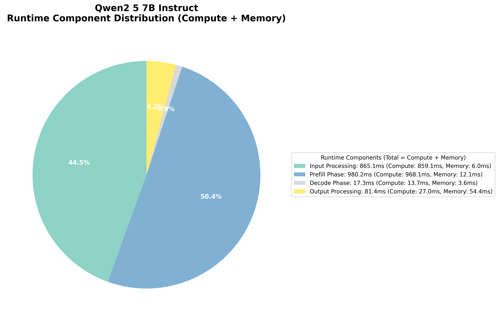

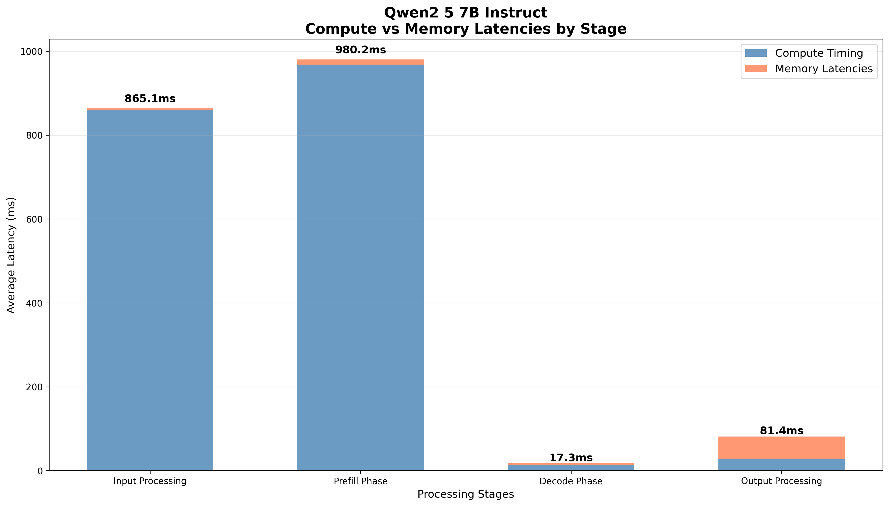

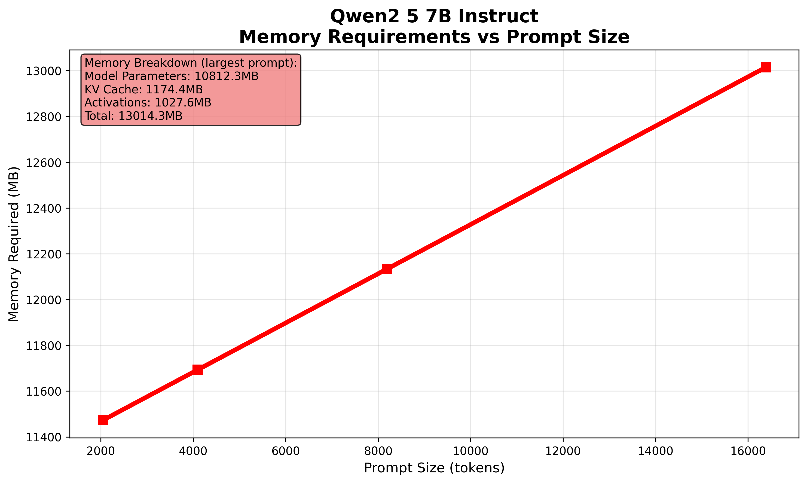

### DeepSeek R1 Distill Qwen 7B  

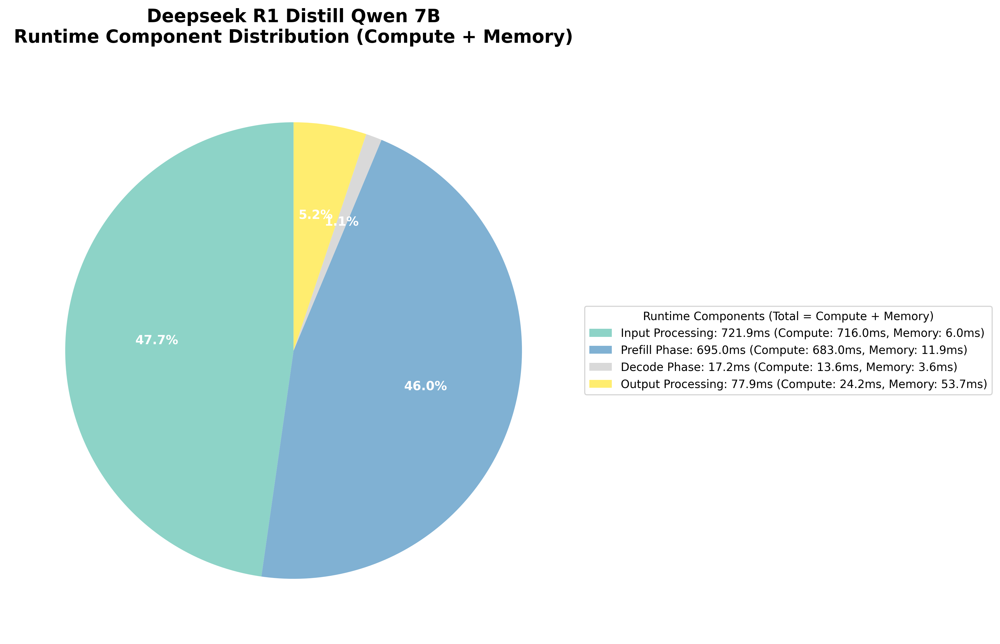

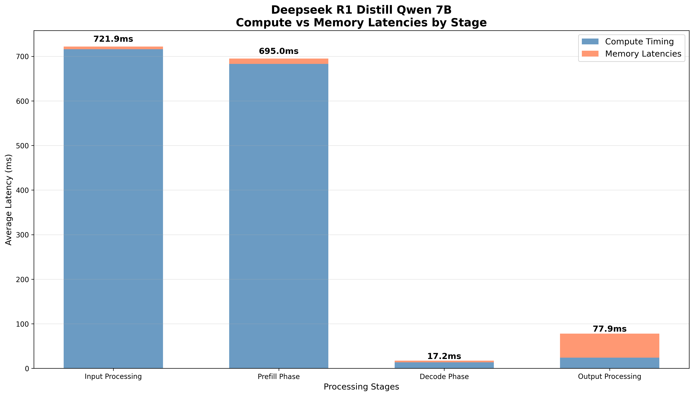

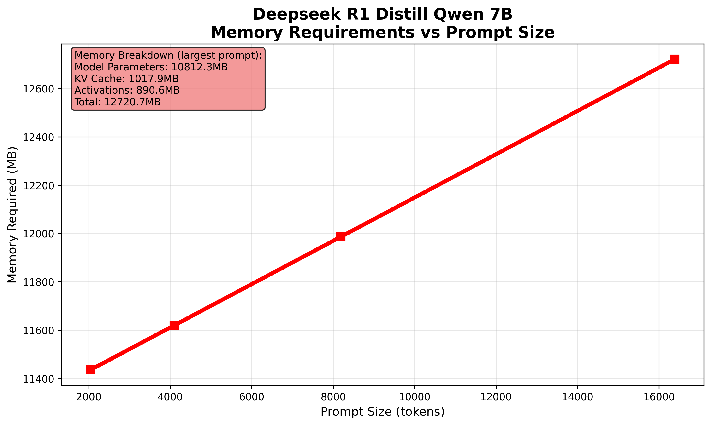

### GPT OSS 20B

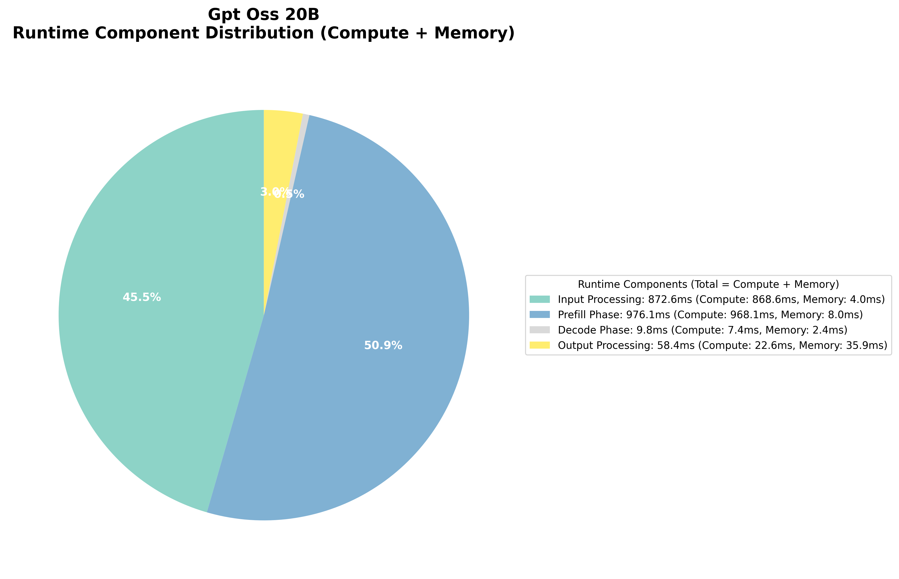

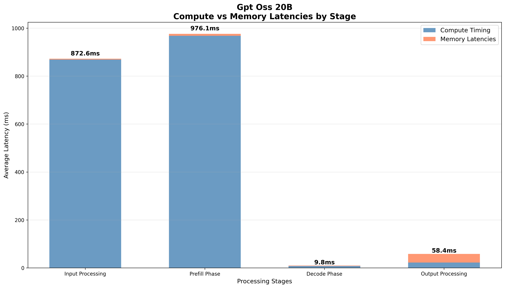

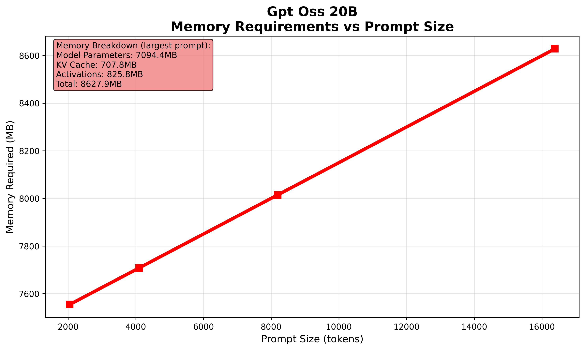

Despite architectural differences between the dense 7B models and sparse MoE 20B model with 3.6B active params, single-request latencies scale similarily.

## Batch Size Impact on Performance

While single-request latency provides insight into model efficiency, production deployments typically serve multiple concurrent requests through batching. Using the same H100 system, we analyzed how batch size affects performance across our three test models. However, larger batch sizes introduce significant tradeoffs between throughput and per-request latency.

**Latency Penalty with Batching**: As batch size increases, per-request latency decreases dramatically but individual request latency suffers. For Qwen 2.5 7B, latency drops from 976ms at BS=1 to 126ms at BS=8, but each individual request now waits longer in the batch queue. This represents the classic throughput-latency tradeoff in LLM serving.

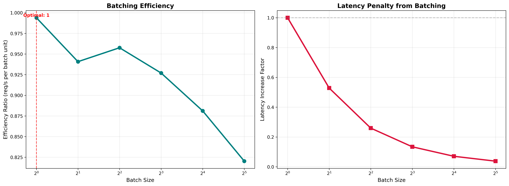

**Memory Scaling Challenges**: Batch size directly impacts memory requirements through KV cache multiplication. Each additional request in a batch requires its own KV cache allocation, leading to linear memory scaling. With corrected KV cache calculations, memory requirements scale more significantly than initially estimated - the H100's 80GB limit becomes a meaningful constraint at moderate batch sizes for longer sequences.

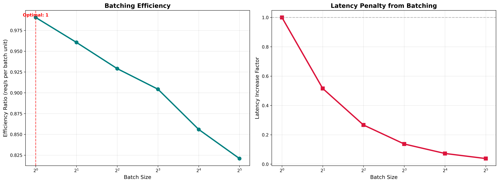

**Diminishing Returns**: Throughput gains from batching show diminishing returns beyond certain batch sizes. While BS=2 provides nearly 2x throughput improvement, scaling from BS=16 to BS=32 yields progressively smaller efficiency gains. This occurs because memory bandwidth becomes increasingly constrained as more requests compete for the same GPU resources.

**Architecture-Specific Behavior**: The MoE model (GPT OSS 20B) shows different scaling characteristics due to its sparse activation patterns. With only 3.6B active parameters per forward pass, it achieves better memory efficiency and can potentially support larger batch sizes before hitting memory constraints, though this comes at the cost of increased routing overhead for expert selection.

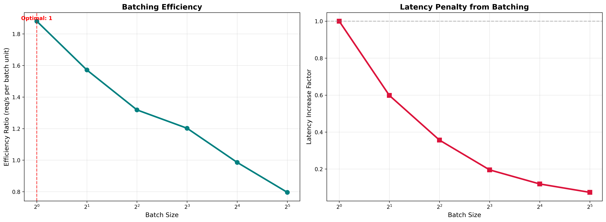

## Future Directions on Latency Optimization Opportunities

Understanding these latency breakdowns reveals optimization strategies beyond traditional hardware scaling. While techniques like quantization and efficient attention can reduce memory bandwidth overhead, a very promising approach challenges sequential token generation itself, which we will discuss in a future blog. This analysis establishes the performance baseline necessary for evaluating such techniques that systematically address the memory bandwidth constraints identified across our inference pipeline.

## What's Next For Us?

We're interested in researching and documenting our journey in optimizing inference on our scalable cloud platform, so subscribe to get notified on how these optimizations play out for us!